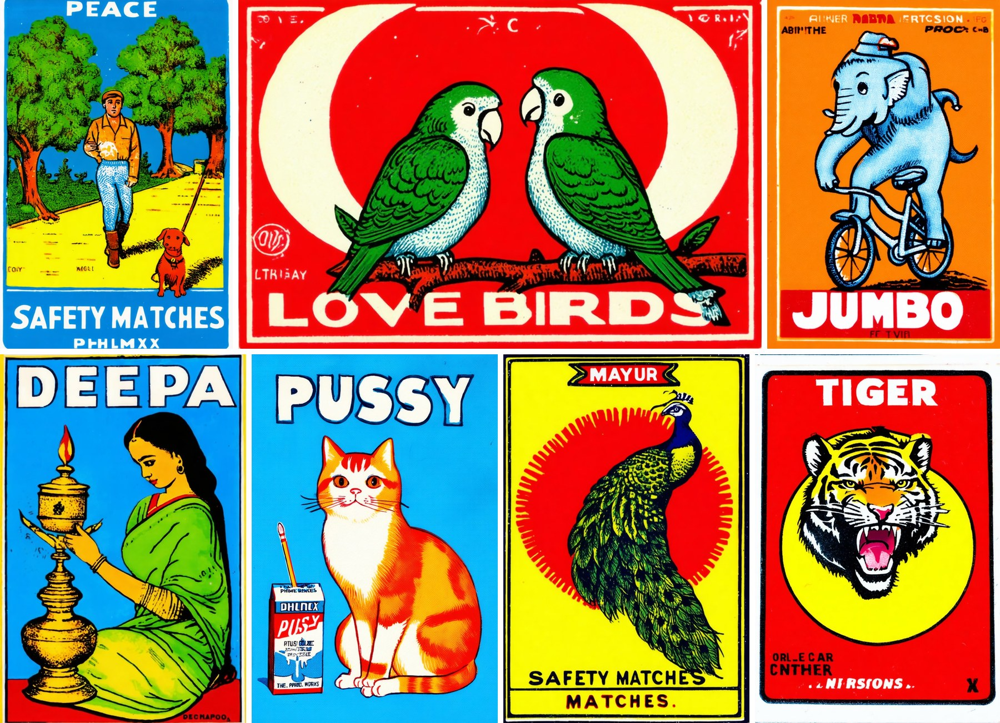
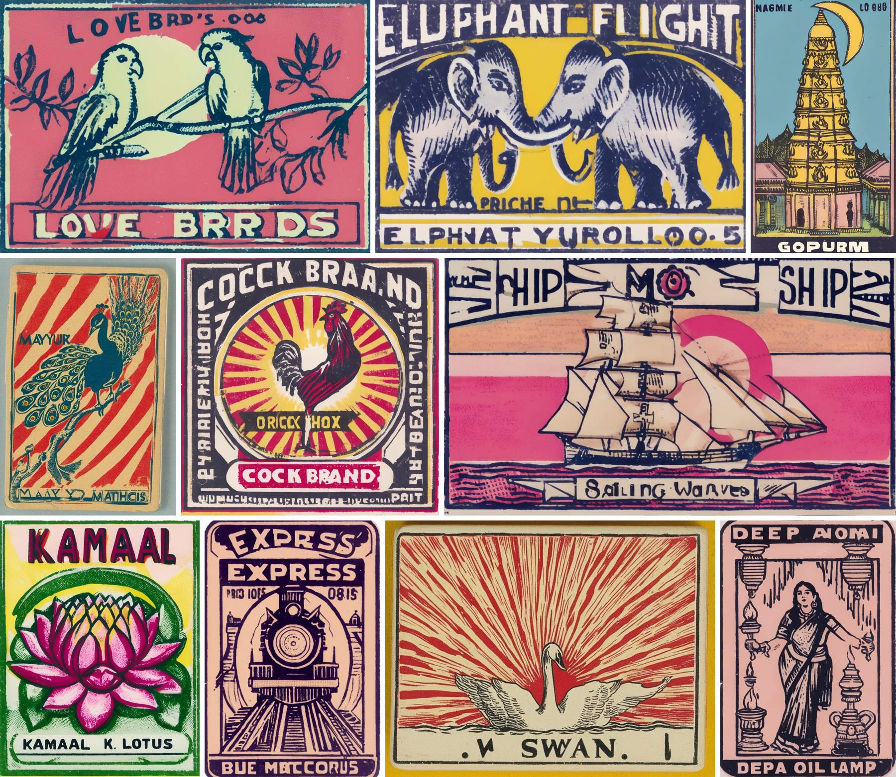
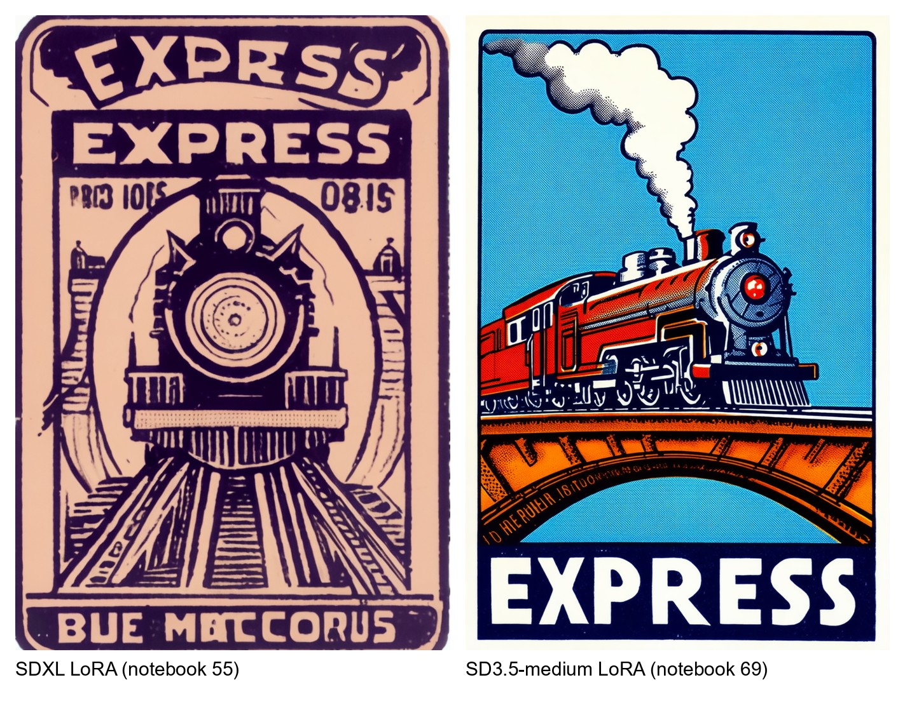
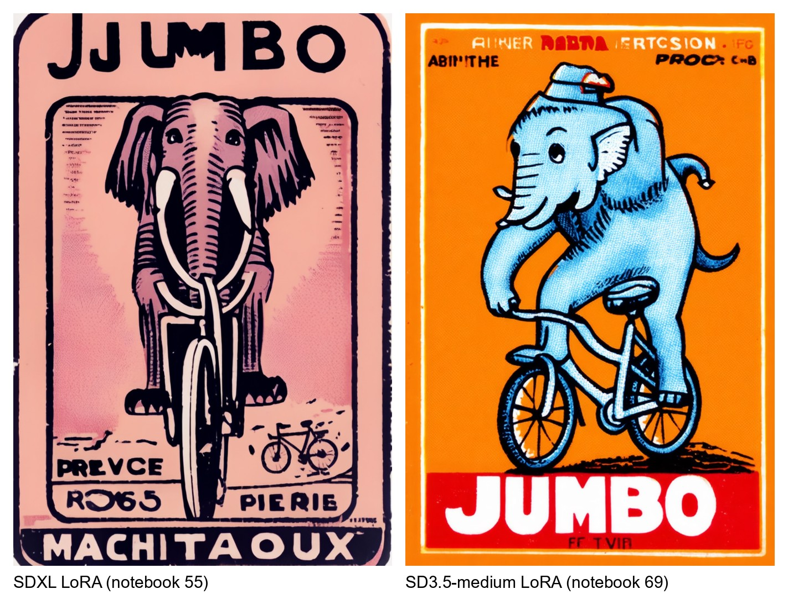
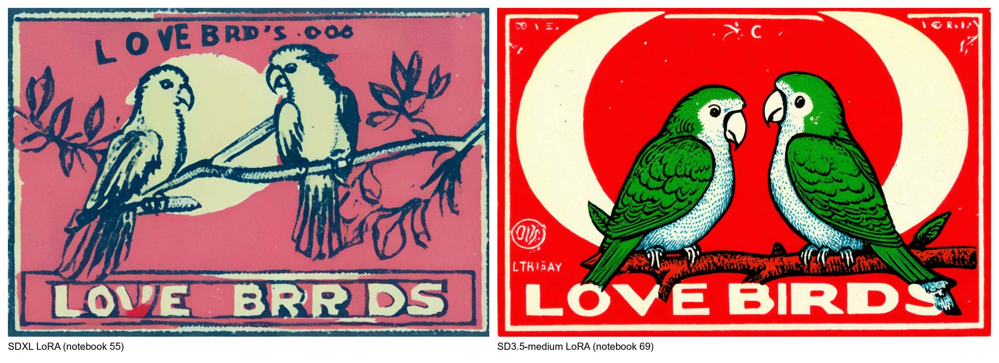
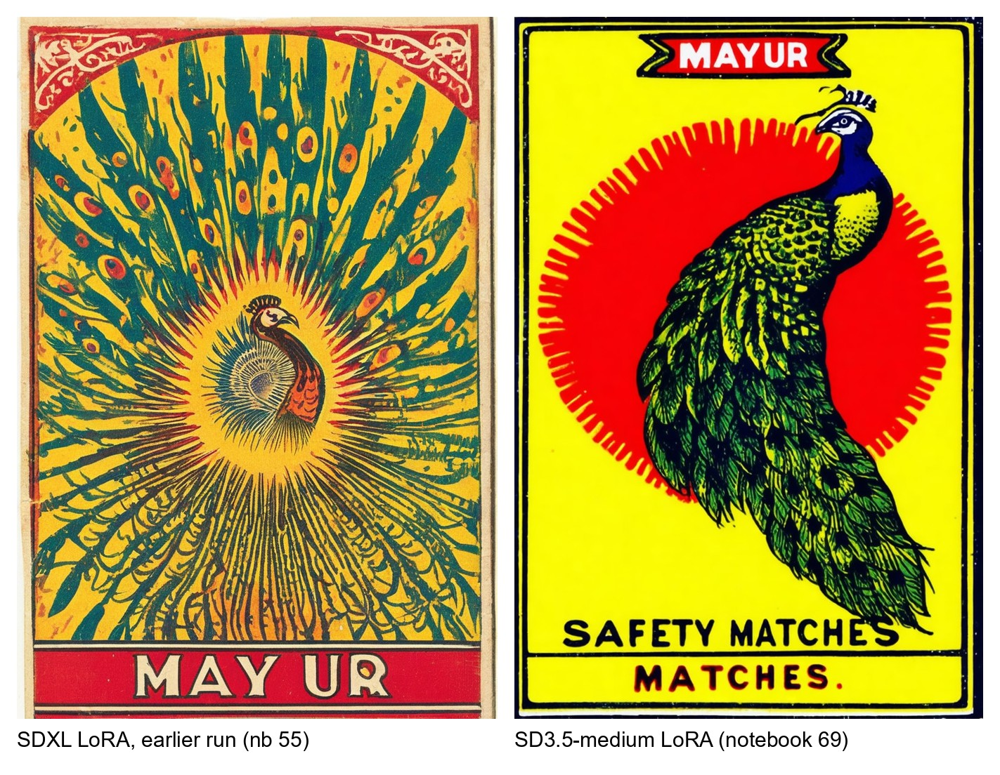
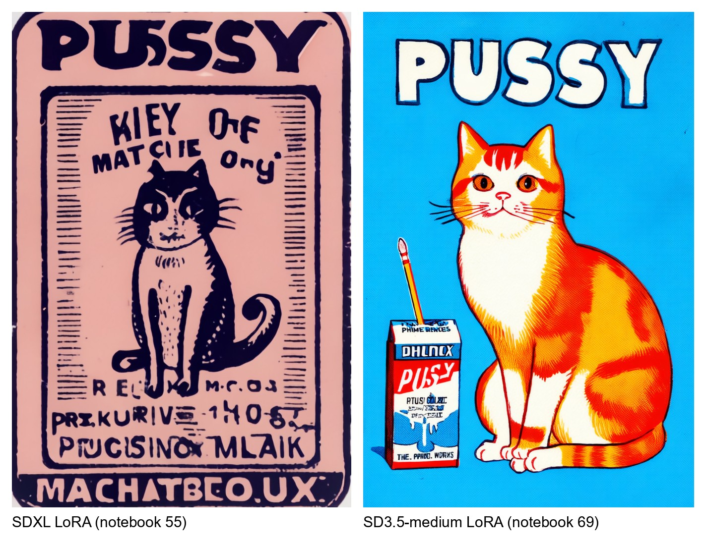

# Indian Matchbox Art Style: Text-to-Image Generator

Two LoRA fine-tunes that generate new **vintage Indian matchbox labels** from a text prompt, trained
on the same 197 labels with two different model families and training objectives:

| | [Notebook 55](notebooks/55_sdxl_matchbox_style_lora.ipynb) | [Notebook 69](notebooks/69_sd35_flow_matching_matchbox_lora.ipynb) |
|---|---|---|
| base model | Stable Diffusion XL 1.0 (U-Net) | Stable Diffusion 3.5-medium (MMDiT transformer) |
| objective | noise prediction (DDPM) | flow matching (velocity prediction) |
| focus | a curation-first training workflow | the flow-matching objective, explained and then used |
| weights | [`sdxl/`](https://huggingface.co/spearb0lt/Indian-Matchbox-Art-Style-Text-to-Image-Generator/tree/main/sdxl) | [`sd3.5-medium/`](https://huggingface.co/spearb0lt/Indian-Matchbox-Art-Style-Text-to-Image-Generator/tree/main/sd3.5-medium) |

**Trigger word:** `phlmx` (from *phillumeny*, the hobby of collecting matchbox labels).

* Weights and model card: [huggingface.co/spearb0lt/Indian-Matchbox-Art-Style-Text-to-Image-Generator](https://huggingface.co/spearb0lt/Indian-Matchbox-Art-Style-Text-to-Image-Generator)
* Training data: [huggingface.co/datasets/spearb0lt/Indian-Matchbox-Labels](https://huggingface.co/datasets/spearb0lt/Indian-Matchbox-Labels)

---

## Gallery

All images below were generated by the trained LoRAs from text alone. The prompt, seed and
settings of every image are in [`images/image_prompts.json`](images/image_prompts.json).

### SD3.5-medium LoRA (notebook 69)



### SDXL LoRA (notebook 55)



*The peacock (MAYUR) and the swan in this gallery come from an earlier SDXL LoRA run of notebook 55 that was trained on Cooper Hewitt museum prints, whose weights are not published; the other eight images come from the published SDXL LoRA. Each image's run is recorded in [`images/image_prompts.json`](images/image_prompts.json).*

The single images are in [`images/69/`](images/69) and [`images/55/`](images/55).

---

## The two models, side by side

Each pair below shows the same subject and the same headline, generated once by each LoRA. Every
image was generated with the settings of its own notebook (see the table after the pairs), so
these are each model's typical output, not a single-variable experiment.

<p align="center"><b>EXPRESS</b><br></p>

<p align="center"><b>JUMBO</b><br></p>

<p align="center"><b>LOVE BIRDS</b><br></p>

<p align="center"><b>MAYUR</b><br></p>

<p align="center"><b>PUSSY</b><br></p>

Left of each pair: SDXL LoRA (notebook 55). Right: SD3.5-medium LoRA (notebook 69). The SDXL image in
the MAYUR pair comes from the earlier SDXL run of notebook 55 (trained on museum prints, weights not
published, seed 478163327 at strength 0.8); the other four SDXL images come from the published SDXL LoRA.

### What differs, as seen in these pairs

* **Lettering.** The SD3.5-medium LoRA spells the headline correctly in all five pairs (EXPRESS,
  JUMBO, LOVE BIRDS, MAYUR, PUSSY); its small secondary text is still often garbled. The SDXL LoRA
  gets some headlines right and misspells others ("LOVE BRRDS", "JJUMBO", "MAY UR"), and fills the
  label with more invented lines of pseudo-text.
* **Colour and finish.** SD3.5-medium produces flat, saturated colour fields (pure reds, yellows
  and blues) with clean outlines, like a crisp reprint. SDXL produces a muted palette with
  ink-on-paper texture, misregistration and engraved line work, more like a worn original.
* **Composition.** Both learned the label layout: a headline band, a central motif, often a
  sunburst or circle, and a bottom band. SDXL tends to add more ornamental borders and frames.

**Which is better?** For legible headlines and clean, bold graphic design, the **SD3.5-medium
LoRA** is better in these samples. The **SDXL LoRA** is the one to choose for an aged, printed-on-old-
paper look, and it is the one that loads in the widest range of tools (its kohya-format file works
in AUTOMATIC1111 and ComfyUI). This judgement is visual. The two notebooks' CLIP scores are not
comparable with each other, because they were measured on different evaluation prompts.

### Why they differ

| | SDXL LoRA (notebook 55) | SD3.5-medium LoRA (notebook 69) |
|---|---|---|
| denoiser | U-Net, 2.57 B parameters | MMDiT transformer, 2.47 B parameters |
| text encoders | CLIP-L + OpenCLIP-bigG | CLIP-L + OpenCLIP-bigG + **T5-XXL** |
| how text reaches the image | cross-attention from image features to the text embeddings | **joint attention**: text and image tokens are concatenated and attend to each other in every block |
| training objective | predict the noise ε added to the image (DDPM), min-SNR-5 loss weighting | predict the velocity ε − x₀ along a straight path from image to noise (flow matching), logit-normal timesteps, shift 3.0 |
| LoRA placement | U-Net attention: `to_q`, `to_k`, `to_v`, `to_out.0` (560 layers, 23.2 M parameters) | both streams of joint attention, image and text (243 layers, 11.9 M parameters) |
| training captions | Florence-2 auto-captions with style words removed (won the notebook's caption ablation) | the hand-written captions, which name the label's headline and maker |
| training resolution | 1024-class aspect-ratio buckets | 768 x 768 pixel area |
| training run | 5 670 steps, batch 1, 124 min on an L4 | 1 418 steps of 4 images, 74 min on an L4 |
| sampler for these images | `EulerDiscreteScheduler`, 30 steps, CFG 6.0, LoRA scale 1.0 | `FlowMatchEulerDiscreteScheduler`, 28 steps, CFG 5.0, LoRA scale 0.9 |

The causes behind the lettering gap, from most to least certain:

1. **The text encoder.** T5-XXL is a large language-model encoder that keeps the individual
   letters and words of the prompt; CLIP encoders were trained to match images to captions and are
   known to be weak at spelling. In SD3.5 those text tokens also take part in every attention
   block, alongside the image tokens.
2. **The captions.** Notebook 69 trained on captions that spell out each label's headline.
   Notebook 55's auto-captions were often longer than SDXL's 77-token text limit (77 % of them), so
   their endings, where Florence-2 usually quotes the label's text, were cut off during training;
   some captions also kept leftover `<pad>` tokens. This is documented in notebook 55 §5.2.
3. **The base models, before any fine-tuning.** Both notebooks generate a strength grid in which
   LoRA scale 0.0 is the untouched base model (55 §13.2, 69 §17). For the same MAYUR peacock prompt,
   base SD3.5-medium already spells "MAYUR" correctly in most seeds and already draws flat,
   saturated colour; base SDXL writes "MAYUX" and paints a softer, more illustrative picture. So a
   large part of the gap is the base model itself, and each LoRA moves its base model towards the
   labels from a different starting point: SDXL's LoRA adds the red-and-yellow sunbursts, bands and
   print texture; SD3.5-medium's LoRA mostly adjusts layout and motifs.

The training objective (noise vs velocity prediction) is the conceptual difference notebook 69
teaches, but these samples do not isolate its effect on quality: model, text encoders, captions
and settings all differ at once.

---

## The data

[spearb0lt/Indian-Matchbox-Labels](https://huggingface.co/datasets/spearb0lt/Indian-Matchbox-Labels):
197 vintage Indian matchbox labels, one label per image, each with a hand-written English caption
that describes the content and the printed text, not the style. Sources: 131 images from Wikimedia
Commons, 46 from the Internet Archive and 20 collected from other websites; every image's source
is listed in `sources.csv`. Most originals are small scans, so 186 images were upscaled 2x or 4x
with a super-resolution model (`caidas/swin2SR-compressed-sr-x4-48`), as recorded per image. Both
models hold out the same kind of split: 189 images for training and 8 for evaluation.

---

## How each notebook works

**Notebook 55: SDXL, curation first.** Loads the folder; removes exact and near-duplicates with
SHA-256, a perceptual hash and DINO embeddings; shows the least typical images for review; splits
off a held-out set; buckets images by aspect ratio; auto-captions them with Florence-2 and strips
style words; checks how the trigger word tokenizes; runs a **caption ablation** (four caption
strategies in short, otherwise identical runs) and trains the main run with the winner; saves
every epoch and **selects the checkpoint** by held-out CLIP style score, prompt adherence and a
DINO **memorisation check**; reloads the chosen file and sweeps its strength; exports diffusers
and kohya files and verifies both load to identical weights; writes a run card; generates.

**Notebook 69: SD3.5-medium, objective first.** Part 1 trains a tiny network on a 2-D toy with
both objectives (velocity and noise), verifies the flow-matching convention against the diffusers
source, compares sampling at 1 to 64 steps, straightens paths with reflow, and works through
timestep sampling and the resolution shift. Part 2 checks which flow-matching transformers fit a
16 GB GPU, caches the three text encoders' outputs and frees them, looks inside the MMDiT block,
trains the LoRA with the flow-matching loss using diffusers' own helpers, tracks a held-out
velocity error at fixed noise levels, reloads the saved file into a fresh pipeline and proves it
reproduces the model, relates everything to Qwen-Image, writes a run card and generates.

### Results of the published runs

| | SDXL LoRA | SD3.5-medium LoRA |
|---|---|---|
| selected checkpoint | epoch 10 of 10 | final step (1 418) |
| held-out style score (CLIP) | 0.583 (base) to 0.672 | 0.580 (base) to 0.592 |
| prompt adherence (CLIP) | 0.321 to 0.320 | 0.326 to 0.327 |
| memorisation check | 0 generations copy a training image | not measured in this notebook |
| other | kohya and diffusers exports verified identical | held-out velocity error lower than the base model at all five fixed noise levels |

Each score is only comparable within its own column (different evaluation prompts). The full
numbers are in each folder's `CARD.json` on Hugging Face.

---

## Use the LoRAs

```python
import torch
from diffusers import StableDiffusionXLPipeline, AutoencoderKL

REPO = "spearb0lt/Indian-Matchbox-Art-Style-Text-to-Image-Generator"
NEG = "photograph, photorealistic, 3d render, blurry, low quality, watermark"

# SDXL LoRA (notebook 55)
vae = AutoencoderKL.from_pretrained("madebyollin/sdxl-vae-fp16-fix", torch_dtype=torch.float16)
pipe = StableDiffusionXLPipeline.from_pretrained("stabilityai/stable-diffusion-xl-base-1.0", vae=vae,
                                                 torch_dtype=torch.float16, variant="fp16").to("cuda")
pipe.load_lora_weights(REPO, subfolder="sdxl", weight_name="phlmx_style_sdxl_ep10_diffusers.safetensors")
image = pipe("phlmx, a matchbox, a white swan swimming in front of a red sunburst, yellow background, "
             "headline 'SWAN BRAND'", negative_prompt=NEG, width=1152, height=896,
             num_inference_steps=30, guidance_scale=6.0).images[0]
```

```python
import torch
from diffusers import StableDiffusion3Pipeline

# SD3.5-medium LoRA (notebook 69). The base model is gated: accept its licence on the Hub first.
pipe = StableDiffusion3Pipeline.from_pretrained("stabilityai/stable-diffusion-3.5-medium",
                                                torch_dtype=torch.bfloat16).to("cuda")
pipe.load_lora_weights(REPO, subfolder="sd3.5-medium", weight_name="pytorch_lora_weights.safetensors")
image = pipe("phlmx, a matchbox label, a roaring tiger's head inside a yellow circle, red background, "
             "headline 'TIGER'", negative_prompt=NEG, width=768, height=1152, num_inference_steps=28,
             guidance_scale=5.0, joint_attention_kwargs={"scale": 0.9}).images[0]
```

**Prompts** work best in the shape of the training captions: `phlmx, a matchbox label, <what is
shown>, <background colour>, headline '<one or two words>'`. Keep headlines short and in English.

**In ComfyUI or AUTOMATIC1111:** download `sdxl/phlmx_style_sdxl_ep10_kohya.safetensors`, put it
in the LoRA folder, and use it with SDXL 1.0 at weight 1.0.

---

## Run the notebooks

Both notebooks were run on Google Colab with an NVIDIA L4 GPU. To run one yourself:

1. Open the notebook in Colab (*File, Upload notebook*, or *File, Open notebook, GitHub* with
   this repository's URL) and choose a GPU runtime (*Runtime, Change runtime type*). An L4 or A100
   matches the published runs; notebook 69 also fits a 16 GB T4 at `FT_RES=512`.
2. For notebook 69 only: accept the licence of
   [stabilityai/stable-diffusion-3.5-medium](https://huggingface.co/stabilityai/stable-diffusion-3.5-medium)
   and add your Hugging Face token as a Colab secret named `HF_TOKEN` (key icon in the left bar).
3. Run all. The setup cell installs the libraries, mounts Google Drive for the outputs and
   downloads the training data from the Hugging Face dataset. If it asks for a session restart
   after installing, restart and run all again.
4. To only generate images, run the cells of section 0 and then the generation section (55 §13,
   69 §17): with no local training run they download the published LoRA.

Setting `FT_QUICK=1` in the first code cell runs every code path with tiny random models in a few
minutes, which checks the setup but produces noise images.

---

## Repository layout

```
notebooks/
  55_sdxl_matchbox_style_lora.ipynb           SDXL LoRA, curation-first workflow, with outputs
  69_sd35_flow_matching_matchbox_lora.ipynb   SD3.5-medium LoRA with flow matching, with outputs
images/
  gallery_55.jpg, gallery_69.jpg   the galleries above
  55/        SDXL LoRA samples
  69/        SD3.5-medium LoRA samples
  compare/   side-by-side pairs
  image_prompts.json   prompt, seed and settings of every image
```

The embedded output images in the notebooks were re-encoded as JPEG to keep each file small enough
for GitHub; the full-resolution generations are not part of this repository.

---

## Licences and credits

* **Weights.** The SDXL LoRA is a derivative of SDXL 1.0 and follows its
  [CreativeML Open RAIL++-M licence](https://huggingface.co/stabilityai/stable-diffusion-xl-base-1.0/blob/main/LICENSE.md).
  The SD3.5-medium LoRA is a derivative of SD3.5-medium and falls under the
  [Stability AI Community License](https://huggingface.co/stabilityai/stable-diffusion-3.5-medium/blob/main/LICENSE.md).
* **Data.** The training images are of mixed provenance (see the dataset card). The labels are
  historical commercial prints; their rights are not cleared, and the dataset and LoRAs are shared
  for research and education.
* **Inspiration.** The project started from a Reddit post about a "desi-max" style LoRA trained on
  Qwen-Image ([yenupam/desi-max](https://huggingface.co/yenupam/desi-max)). Its training data was not
  published, so this project collected its own matchbox labels and used models that fit a single
  24 GB GPU.
